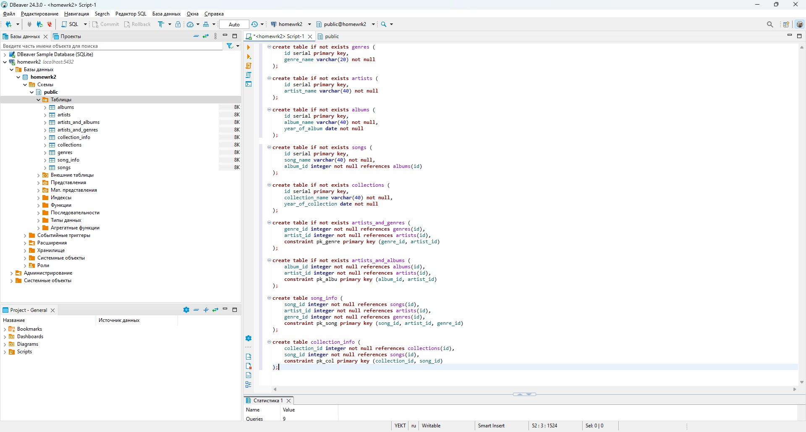
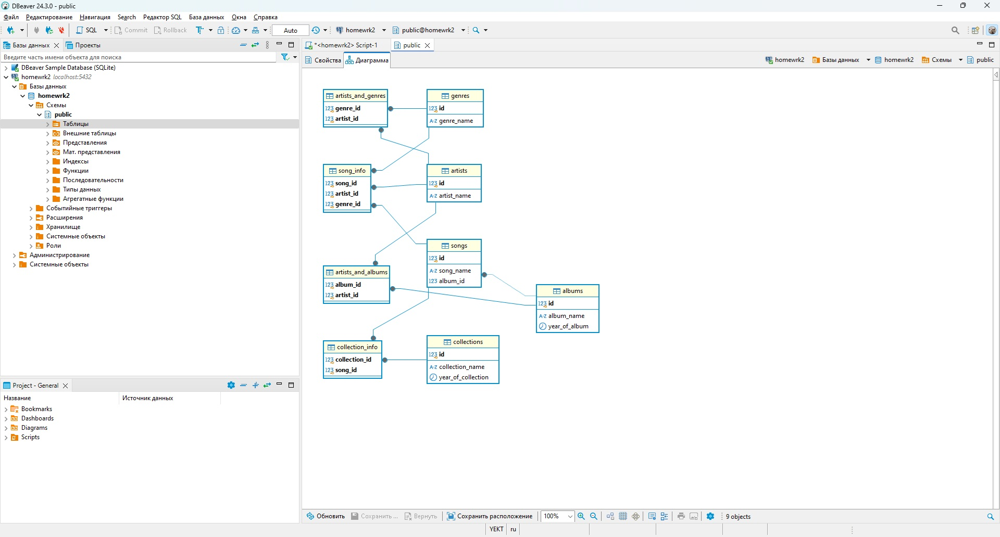
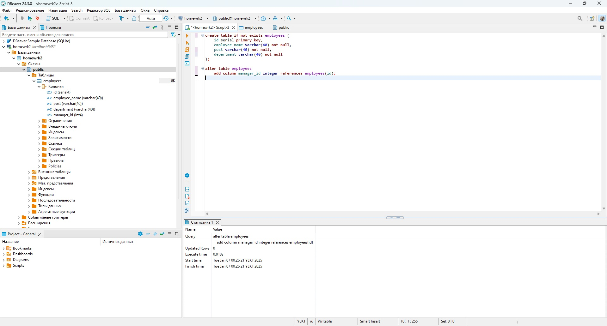
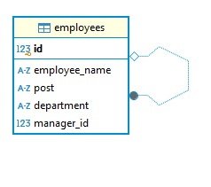

# Домашняя работа
## Задание 1
Для создания базы данных музыкального сайта были использованы команды:
```sh
create table if not exists genres (
	id serial primary key, 
	genre_name varchar(20) not null
);

create table if not exists artists (
	id serial primary key, 
	artist_name varchar(40) not null
);

create table if not exists albums (
	id serial primary key, 
	album_name varchar(40) not null, 
	year_of_album date not null
);

create table if not exists songs (
	id serial primary key, 
	song_name varchar(40) not null,
	album_id integer not null references albums(id)
);

create table if not exists collections (
	id serial primary key, 
	collection_name varchar(40) not null, 
	year_of_collection date not null
);

create table if not exists artists_and_genres (
	genre_id integer not null references genres(id),
	artist_id integer not null references artists(id),
	constraint pk_genre primary key (genre_id, artist_id)
);

create table if not exists artists_and_albums (
	album_id integer not null references albums(id),
	artist_id integer not null references artists(id),
	constraint pk_albu primary key (album_id, artist_id)
);

create table song_info (
	song_id integer not null references songs(id),
	artist_id integer not null references artists(id),
	genre_id integer not null references genres(id),
	constraint pk_song primary key (song_id, artist_id, genre_id)
);

create table collection_info (
	collection_id integer not null references collections(id),
	song_id integer not null references songs(id),
	constraint pk_col primary key (collection_id, song_id)
);
```
Результат создания таблиц:

Диаграмма связей таблиц БД:

## Задание 2
Для создания базы данных сотрудников были использованы команды:
```sh
CREATE TABLE employees (
	id SERIAL PRIMARY KEY,
	employee_name VARCHAR(40) NOT NULL,
	post VARCHAR(40) NOT NULL, 
	department VARCHAR(40) NOT NULL
);

ALTER TABLE employees 
	ADD COLUMN manager_id INTEGER REFERENCES employees(id);

```
Результат создания таблиц:

Диаграмма связей таблиц БД:
